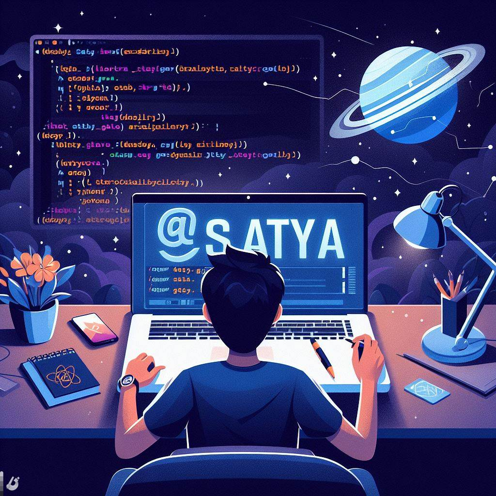
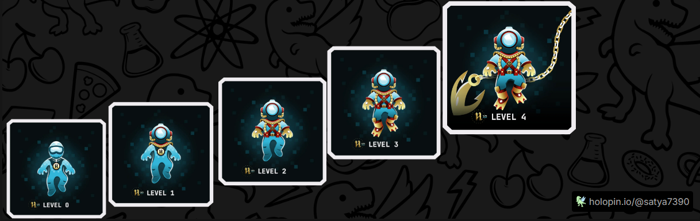
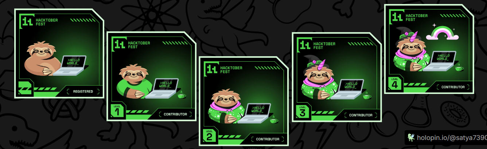

<h1 align="center">Hi 👋, I'm Satyanand Gupta</h1>
<h3 align="center">A passionate FullStack developer from India</h3>

  

  

---

<h2>🔧 About Me</h2>
<ul>
  <li>🌱 I’m currently learning <strong>Google Cloud</strong>, advanced development courses, and new technologies.</li>
  <li>👨‍💻 I’m currently working on <strong>Full Stack Web Development</strong> using MERN stack.</li>
  <li>🤝 I’m open to collaboration and mentorship in tech communities.</li>
  <li>💡 I’m always eager to help others and grow together in tech.</li>
  <li>🔗 My portfolio: <a href="https://satya-portfolio.vercel.app" target="_blank">Satya's Portfolio</a></li>
</ul>

---

<h2>💬 Ask Me About</h2>
<strong>🌐 Frontend | ☁️ Google Cloud Arcade Programs | 📡 IoT | 🧠 New Technologies</strong>

<h3 align="left">Connect with me:</h3>

- 📧 Email: [techsatya730@gmail.com](mailto:techsatya730@gmail.com)

  
  
  
  
  

  

---

## 📁 Explore My Work

- 👨‍💻 All my projects are showcased on my [Portfolio Website](https://satya-portfolio.vercel.app/)
- 📎 My Resume/CV: [View on Google Drive](https://drive.google.com/file/d/1IPuB7jnN-GqBqcGZJMk8BdtJVabTEGjp/view?usp=sharing)

---

## 🎧 Hobbies & Interests

- 🎵 Singing & Listening to Music
- 🏸 Playing Badminton
- 🧠 Solving DSA problems
- 💻 Building Projects & Contributing to Open Source

---

> "Code. Collaborate. Create Impact." — Let's build something amazing together!

<h3 align="left">Languages and Tools:</h3>

 
 
  
 
 
 
 
 
 
 
 
 
 
 

 

&nbsp;

 

 

<h3 align="left">Hacktoberfest '23 Badges 🚀</h3>
 
 

<h3 align="left">Hacktoberfest '24 Badges 🚀</h3>
 
 

